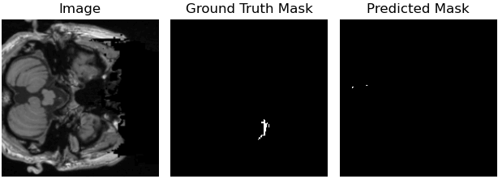

# [BeSt-LeS: Benchmarking Stroke Lesion Segmentation using Deep Supervision]
# (In progress)
## Introduction

Brain stroke has become a significant burden on global health and thus we need remedies and prevention strategies to overcome this challenge. For this, the immediate identification of stroke and risk stratification is the primary task for clinicians. To aid expert clinicians, automated segmentation models are crucial. In this work, we consider the publicly available dataset ATLAS v2.0 to benchmark various end-to-end supervised U-Net style models. Specifically, we have benchmarked models on both 2D and 3D brain images and evaluated them using standard metrics. We have achieved the highest Dice score of 0.583 on the 2D transformer-based model and 0.504 on the 3D residual U-Net respectively. We have conducted the Wilcoxon test for 3D models to correlate the relationship between predicted and actual stroke volume. For reproducibility, the code and model weights are made  available here.

## Results

### 2D U-Net Architectures

The first three models are pure convolution-based architectures, while the remaining two are hybrid networks combining convolutions and transformer components. The performance of the models on the test set is reported below.

| Method                | Dice Score | IoU Score | Precision | Recall |
|-----------------------|------------|-----------|-----------|--------|
| U-Net                 | 0.417      | 0.337     | 0.580     | 0.360  |
| Residual U-Net        | 0.456      | 0.375     | 0.592     | 0.420  |
| Attention U-Net       | 0.487      | 0.396     | 0.636     | 0.439  |
| TransAttn U-Net       | 0.572      | *0.477*   | *0.660*   | 0.565  |
| U-Net Transformer     | *0.583*    | 0.475     | 0.659     | *0.591*|

### 3D U-Net Architectures

The table below illustrates the performance of variants of 3D U-Net architectures. These models are pure convolution-based architectures. The performance of the models on the test set is reported below.

| Method                | Dice Score | IoU Score | Precision | Recall |
|-----------------------|------------|-----------|-----------|--------|
| U-Net                 | 0.450      | 0.350     | 0.584     | 0.444  |
| Residual U-Net        | *0.504*    | *0.393*   | *0.585*   | 0.533  |
| Attention U-Net       | 0.469      | 0.369     | 0.498     | *0.578*|

### Visualizations of 2D models 

#### U-Net & Residual U-Net

<table>
  <tr>
    <td style="text-align:center"><strong>U-Net</strong> </td>
    <td style="text-align:center"><strong>Residual U-Net</strong> </td>
  </tr>
</table>

#### Attention U-Net & TransAttn U-Net

<table>
  <tr>
    <td style="text-align:center"><strong>Attention U-Net</strong> </td>
    <td style="text-align:center"><strong>TransAttn U-Net</strong> </td>
  </tr>
</table>

#### U-Net Transformer

<strong>U-Net Transformer</strong> 

## Table of Contents

1. [Getting Started](#getting-started)
    - [Prerequisites](#prerequisites)
    - [Installation](#installation)
2. [Results](#results)
3. [Contributing](#contributing)
4. [License](#license)
5. [Acknowledgments](#acknowledgments)

## Getting Started

Explain how to get started with your project. Provide step-by-step instructions for setting up the environment and running the code.

### Prerequisites
List the software, libraries, and dependencies:
Python 3.9.12

Pytorch 1.12.1

Numpy 1.23.5

Scikit-learn 1.2.2

Nibable 5.1.0

Scipy 1.10.1

Nilearn 0.10.1

cv2 4.7.0

### Installation:

## Results:

## Contributing:

## License:

## Acknowledgments:

## References:

