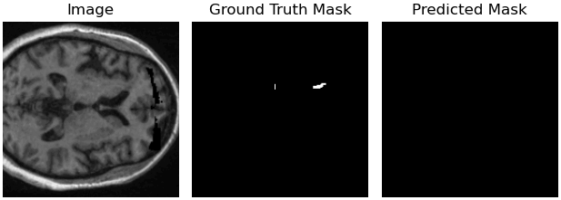
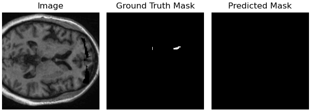
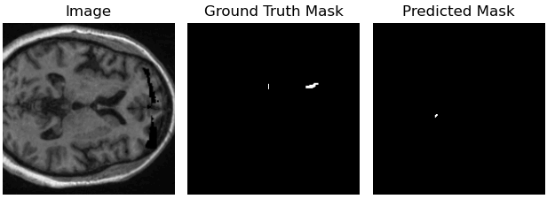
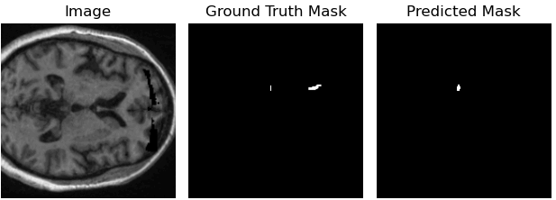

# [BeSt-LeS: Benchmarking Stroke Lesion Segmentation using Deep Supervision]
[arXiv paper]([https://arxiv.org/abs/1234.56789](https://arxiv.org/abs/2310.07060))

*In Progress*

## Introduction

Brain stroke poses a significant challenge to global health. Effective remedies and prevention strategies are crucial. The immediate identification of stroke and risk stratification is vital for clinicians. Automated segmentation models play a key role in assisting experts. This work benchmarks various end-to-end supervised U-Net style models using the ATLAS v2.0 dataset, focusing on 2D and 3D brain images. We achieved the highest Dice score of 0.583 with a 2D transformer-based model and 0.504 with a 3D residual U-Net. The Wilcoxon test was conducted for 3D models to correlate predicted and actual stroke volumes. For reproducibility, code and model weights are available here.

## Results

### 2D U-Net Architectures

The following table presents the performance metrics of various 2D U-Net models:

| Method                | Dice Score | IoU Score | Precision | Recall |
|-----------------------|------------|-----------|-----------|--------|
| U-Net                 | 0.417      | 0.337     | 0.580     | 0.360  |
| Residual U-Net        | 0.456      | 0.375     | 0.592     | 0.420  |
| Attention U-Net       | 0.487      | 0.396     | 0.636     | 0.439  |
| TransAttn U-Net       | 0.572      | *0.477*   | *0.660*   | 0.565  |
| U-Net Transformer     | *0.583*    | 0.475     | 0.659     | *0.591*|

### 3D U-Net Architectures

The table below illustrates the performance of various 3D U-Net models:

| Method                | Dice Score | IoU Score | Precision | Recall |
|-----------------------|------------|-----------|-----------|--------|
| U-Net                 | 0.450      | 0.350     | 0.584     | 0.444  |
| Residual U-Net        | *0.504*    | *0.393*   | *0.585*   | 0.533  |
| Attention U-Net       | 0.469      | 0.369     | 0.498     | *0.578*|

### Visualizations of 2D Models

Here are visualizations of the 2D models, organized into two sections for clarity:

#### Model Visualizations (Subject ID: sub-r004s004)

<table>
  <tr>
    <td style="text-align:center; vertical-align:middle"><strong>U-Net</strong> </td>
    <td style="text-align:center; vertical-align:middle"><strong>Residual U-Net</strong> </td>
    <td style="text-align:center; vertical-align:middle"><strong>Attention U-Net</strong> </td>
  </tr>
  <tr>
    <td colspan="3" style="text-align:center; padding:10px;"></td>
  </tr>
  <tr>
    <td style="text-align:center; vertical-align:middle"><strong>TransAttn U-Net</strong> </td>
    <td style="text-align:center; vertical-align:middle"><strong>U-Net Transformer</strong> </td>
  </tr>
</table>

#### Model Visualizations (Subject ID: sub-r027s050)

<table>
  <tr>
    <td style="text-align:center; vertical-align:middle"><strong>U-Net</strong> </td>
    <td style="text-align:center; vertical-align:middle"><strong>Residual U-Net</strong> </td>
    <td style="text-align:center; vertical-align:middle"><strong>Attention U-Net</strong> </td>
  </tr>
  <tr>
    <td style="text-align:center; vertical-align:middle"><strong>U-Net Transformer</strong> </td>
    <td style="text-align:center; vertical-align:middle"><strong>TransAttn U-Net</strong> </td>
  </tr>
</table>

## Table of Contents

1. [Getting Started](#getting-started)
    - [Prerequisites](#prerequisites)
    - [Installation](#installation)
2. [Results](#results)
3. [Contributing](#contributing)
4. [License](#license)
5. [Acknowledgments](#acknowledgments)

## Getting Started

Explain how to get started with your project. Provide step-by-step instructions for setting up the environment and running the code.

### Prerequisites
List the software, libraries, and dependencies:
Python 3.9.12

Pytorch 1.12.1

Numpy 1.23.5

Scikit-learn 1.2.2

Nibable 5.1.0

Scipy 1.10.1

Nilearn 0.10.1

cv2 4.7.0

### Installation:

## Results:

## Contributing:

## License:

## Acknowledgments:

## References:

